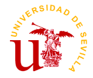

    

# Grupo 10 - Go4Surprise

## 10 - KBreport

### Sprint 1

### Integrantes

- Mohamed Abouri  
- Mario Astudillo Fierro  
- María Barrancos Márquez  
- Rafael Cabello Ranea  
- Manuel Chica López  
- David Delgado Pallares  
- José Gonzalo Domínguez Moreno  
- Virginia Mesa Pérez  
- José Manuel Miret Martín  
- Alejandro Nicolade Bravo  
- Manuel Palacios Pineda  
- Pablo Rodríguez Sánchez  
- Rubén Romero Sánchez  
- Paula Sánchez Gómez  
- Ramón Vergara Garrido  

---

## **Sprint 1**

### **Nuestra Aportación**

Durante todas las clases hemos ido recopilando todo el feedback que han ido recibiendo los distintos grupos junto el nuestro. Esta información está recogida en [este enlace](https://bcc2425.vercel.app/docs/grupos-tarde/Grupo%2010).

A su vez, hemos contribuido en el conocimiento común de la semana 4 de todos los grupos. Esta información se encuentra en [este otro enlace](https://bcc2425.vercel.app/docs/category/conocimiento-com%C3%BAn).

Vamos a detallar un poco más lo que contienen la Semana 3 y la Semana 4, junto con lo introducido en el conocimiento común:

#### **Semana 3**

#### **Semana 4**

#### **Conocimiento común de la semana 4**

#### **Tareas y Recomendaciones**

---

### **Conclusión**

[Enlace a la base de conocimiento](https://bcc2425.vercel.app/docs/grupos-tarde/Grupo%2010)
