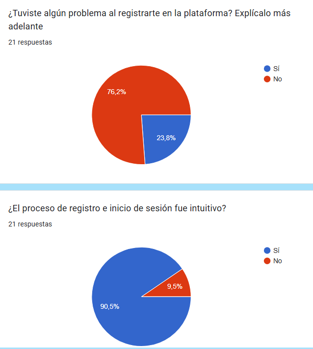

# Usuarios Pilotos

Creado por: David Delgado Pallares
Fecha de creación: 13 de marzo de 2025 22:59
Categoría: Investigación 🧑‍🔬
Fecha de última actualización: 13 de marzo de 2025 23:32
Creado por 1: David Delgado Pallares
Entregable: Sprint 1

<aside>
ISPP - Grupo 10

Go4Surprise

</aside>

# Usuarios Pilotos

Entregable: Primero

Contenido: En este documento se incluyen los ⁠usuarios pilotos que influyen en nuestro proyecto, incluyendo los objetivos, el criterio de selección, las necesidades, las motivaciones, y las protopersonas que lo forman. 

**Miembros del equipo:**

- Astudillo, Mario

- Abouri, Mohamed

- Barrancos, María

- Cabello, Rafael

- Chica, Manuel

- Delgado, David

- Domínguez, Gonzalo

- Mesa, Virginia

- Miret, José Manuel

- Nicolade, Alejandro

- Palacios, Manuel

- Rodrígez, Pablo

- Romero, Rubén

- Sánchez, Paula

- Vergara, Ramón

Fecha: 13/03/2025

## Introducción

Este documento detalla el proceso de gestión de los usuarios piloto para comprobar el funcionamiento de la aplicación Go4Surprise, asegurando su correcta integración, comunicación y análisis de feedback. Los usuarios pilotos nos permitirán validar nuestra idea de negocio, mejorar la experiencia y detectar posibles mejoras antes del lanzamiento final de la aplicación.

## Gestión de Usuarios Piloto

1. Selección de Usuarios y categorías

Los usuarios piloto se han seleccionado mediante una encuesta previa en la que se recoge información detallada de cada usuario.

En la siguiente tabla se muestra una lista de los usuarios pilotos que se ofrecieron a colaborar en este proyecto dándonos su feedback, el cual nos ayudará para guiarnos en la creación de las distintas funcionalidades gracias a las necesidades de estos usuarios acerca de la idea de nuestra aplicación: PlayTogether.

En total contaremos con la colaboración de 19 clientes pilotos para este proyecto.

| **Nº** | **NOMBRE** |
| --- | --- |
| 1 | Laura M.P |
| 2 | Isabel Cantero Corchero |
| 3 | Jun Yao |
| 4 | Manuel Miret Izquierdo |
| 5 | Ana María Martín Bejarano |
| 6 | Lidia Maria Ramos Donoso |
| 7 | Aida V.C. |
| 8 | Guadalupe R.P. |
| 9 | Ángela Romero |
| 10 | Rubén Cerrato Tapia |
| 11 | Ignacio Blanquero Blanco |
| 12 | Alvaro M.M. |
| 13 | Curro G.F |
| 14 | Laura Ortega Martin |
| 15 | Merche L.M |
| 16 | Pablo F.P |
| 17 | David V.J |
| 18 | María Jurado Expósito |
| 19 | Victor Luque Gonzalez |

### Planificación de pruebas y feedback

# Sprint 1

Durante este primer sprint en un inicio hemos planteado dividir cada una de las tareas principales (Inicio de sesión, Base de datos, Pantalla principal, Formulario) en diferentes tareas:

- INICIO DE SESIÓN:
    - Registro
    - Inicio de sesión
    - Cuestionario inicial
    - Perfil del usuario
- SISTEMA DE RESERVAS
    - Cuestionario del evento sorpresa
    - Listado de las reservas del usuario
    - Pantalla principal
    - Mostrar las reseñas y los eventos registrados

# Sprint 2

- PERFIL DE USUARIO
    - Recuperar contraseña
- RESERVA DEL EVENTO SORPRESA:
    - Mapa de selección geográfica
    - Descartar categorías (CASO DE USO)
    - Pistas del evento sorpresa por correo (CASO DE USO)
- PASARELA DE PAGO
    - Configuración de la pasarela de pago
    - Conectar con la pasarela de pago
    - Cálculo del precio de la reserva total y por persona
    - Webhook

# Sprint 3

| **Tarea** | **Duración** | **Descripción** |
| --- | --- | --- |
| **Implementación de calendario y notificaciones** | 4 días | Desarrollar sistema de notificaciones y recordatorios para usuarios. |
| **Optimización y corrección de errores** | 3 días | Resolver bugs y mejorar rendimiento. |
| **Desarrollo de la red social interna** | 4 días | Implementar sistema básico de interacciones y compartición de experiencias. |

### Comunicación

Los principales canales de comunicación con los usuarios pilotos serán:

- **Email:** Confirmaciones, recordatorios y encuestas.
- **Grupo de WhatsApp:** Comunicación directa y resolución de dudas.
- **Reuniones virtuales:** Entrevistas/Reuniones mediante un servidor de Discord al que todos tendrán acceso para recibir un feedback más detallado, donde poder informar de errores o incidencias.
- **Google Forms:** Encuestas para recopilar el feedback y tener evidencias concretas de la satisfacción de los usuarios.

### Recompensas

Para incentivar la participación activa, los usuarios piloto recibirán:

- Descuentos exclusivos en futuras experiencias.
- Acceso a eventos VIP.
- Sorteos de experiencias sorpresa.
- Beneficios adicionales por completar encuestas detalladas.
1. Análisis de feedback

Los datos recopilados se analizarán mediante:

- Encuestas de satisfacción.
- Evaluación de funcionalidades y experiencia de usuario.
- Identificación de mejoras y puntos de fricción.

Los datos recopilados y las aportaciones realizadas por los usuarios pilotos se recogerán en un documento que contendrá:

- Fecha de acceso al sistema
- Fecha del feedback
- Fallos y mejoras aportadas
- Métricas de satisfacción del usuario
- Puntuaciones de usabilidad
- Tiempos de espera

Este documento servirá para mantener una trazabilidad del feedback, y poder ver cómo evoluciona éste durante el desarrollo de la aplicación, optimizando la plataforma antes del lanzamiento oficial.

### Compromisos

● Los usuarios piloto se comprometen a probar la aplicación dentro del periodo establecido y a proporcionar feedback detallado y constructivo sobre su experiencia.
● Se comprometen a entregar ese feedback como máximo a las 12:00h del día de finalización del sprint.
● Se comprometen a seguir las instrucciones proporcionadas en la Guía para Usuarios Piloto en cada sprint.
● Los usuarios piloto aceptan no divulgar información sensible o detalles sobre la
plataforma a terceros.

Las pruebas se realizan a lo largo del desarrollo de la aplicación, con un calendario estructurado para garantizar una evaluación progresiva.

## Feedback Recibido

A continuación, adjunto las respuestas de los usuarios:

