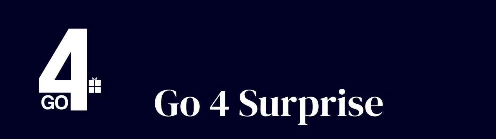

# Análisis de Costes

<aside>
ISPP - Grupo 10

Go4Surprise

</aside>

**Contenido:** En este documento se describe cómo vamos a ganar dinero y el análisis preliminar de costes del proyecto.

**Miembros del equipo:**

- Abouri, Mohamed
- Astudillo, Mario
- Barrancos, María
- Cabello, Rafael
- Chica, Manuel
- Delgado, David
- Domínguez, Gonzalo
- Mesa, Virginia
- Miret, José Manuel
- Nicolade, Alejandro
- Palacios, Manuel
- Rodrígez, Pablo
- Romero, Rubén
- Sánchez, Paula
- Vergara, Ramón

**Fecha:** 17 de febrero de 2025

# **TCO**

| **Fecha**   | **Versión** |
|------------|-------------|
| 27/03/2025 | v05         |

# **1. Introducción**

Nuestra plataforma actúa como intermediario entre clientes/usuarios y empresas de ocio, ayudando a los clientes en su elección de plan de ocio, eliminando la indecisión y alimentando la curiosidad y las ganas de vivir experiencias.

# **2. Análisis de Gastos**

## **2.1 Modelo de negocio**

1. **Acuerdos Comerciales con Empresas**

La plataforma establece convenios con empresas de ocio, quienes ofrecen sus servicios a precios preferenciales a cambio de atraer un mayor número de clientes. De este modo las empresas se benefician ya que se aseguran un número fijo de ventas mínimas y nosotros nos vemos beneficiados al adquirir los servicios a un precio inferior o promocional.

2. **Comisiones por Reserva**

Cada vez que un usuario reserva una experiencia, la empresa de ocio paga una comisión a la plataforma. Esta puede ser fija o variable, dependiendo del evento.

Este modelo es atractivo ya que así las empresas pagan cuando consiguen clientes viendo el gasto como una inversión y no como un costo fijo. Por otra parte, puedes ajustar las

comisiones según la categoría del evento (mayor porcentaje en experiencias más costosas) y es escalable, más reservas = más ingresos.

3. **Descartes de Categoría**

El usuario tendrá la opción de descartar categoría para aquellas experiencias que si o si no quiere tener. El primer descarte es gratuito y después de ello tendrá que pagar 5€ por cada categoría descartada no nos dará grandes beneficios pero siempre sumará en los ingresos

## **2.2 Análisis preliminar de costes**

Dado que go4surprise es una plataforma intermediaria, los costes se pueden dividir en costes fijos (los que debes pagar regularmente) y costes variables (los que dependen del volumen de reservas y suscripciones).

### **2.2.1 CAPEX**

Desarrollo y despliegue de la plataforma:

| **Gasto**                        | **Desarrollo**                           | **Total**     |
|---------------------------------|------------------------------------------|---------------|
| Google App Engine (despliegue)   | 0,093€ * 24h * 70 días                    | 156,24 €      |
| Dominio IONOS                    | Plan del primer año                       | 1 €           |
| Legal y registro de empresa      | Cumplimiento RGPD y asesoría legal         | 1.000 €       |

El gasto Legal y registro de empresa asegura que go4surprise esté protegida legalmente, evitar sanciones y generar confianza en clientes y empresas.

**Costes del equipo (16 personas, 14 semanas):**

Los 16 miembros del equipo cobran como desarrolladores juniores. Suponiendo que los desarrolladores de frontend cobran un salario de 20€/h, que los de backend cobran un salario de 22€/h y con un mínimo semanal de 10 horas trabajadas, tenemos:

- **Frontend:** 8 personas × 20 €/h × 10 h/semana × 14 semanas = **22,400 €**
- **Backend:** 8 personas × 22 €/h × 10 h/semana × 14 semanas = **24,640 €**

**.** **Total de salarios brutos:** **47.040 €**

**Costes sociales**

Considerando las **cotizaciones empresariales** sobre el salario bruto, que incluyen:

1. **Contingencias Comunes** (23.60%)
2. **Desempleo** (5.50% para contratos indefinidos, 6.70% para temporales)
3. **Formación Profesional** (0.60%)
4. **Fondo de Garantía Salarial (FOGASA)** (0.20%)
5. **Accidentes de Trabajo y Enfermedades Profesionales** (variable según sector, usaré un 1.50% como referencia)

| **Concepto**                                   | **% sobre salario** | **Coste (€)**  |
| ----------------------------------------------- | -------------------- | -------------- |
| **Contingencias Comunes**                       | 23.60%               | 11.101,44€      |
| **Desempleo (contrato indefinido)**              | 5.50%                | 2.587,20€       |
| **Formación Profesional**                       | 0.60%                | 282,24€         |
| **FOGASA** (Fondo de Garantía Salarial)           | 0.20%                | 94,08€          |
| **Accidentes de Trabajo** (estimado)             | 1.50%                | 705,60€         |
| **Total Costes Sociales**                        | **31.40%**           | **14.770,56€**  |

Total coste equipo (salario + costes sociales): 6.810,56 €

### **2.2.2 OPEX**

Estos costes aumentan o disminuyen según la cantidad de usuarios y reservas que maneje la plataforma:

**Procesamientos de pago:** 
las pasarelas de pago cobran entre un 2,5% y un 3,5% por cada transacción.

Suponiendo 1000 reservas al mes con un 3% por transacción, estimamos un gasto de 1500€ en los dos meses y medio de desarrollo. Lo que nos puede resultar en 600€ al mes de manera estimada

**Soporte al cliente:** Teniendo en cuenta el soporte humano si fuese necesario y plataformas como Zendesk o Intercom para ayudarnos con el soporte. En la fase inicial de la plataforma se plantea el uso de herramientas gratuitas como Tidio o Crisp y a medida que crezca la

plataforma se cambiarán por alguna de las mencionadas anteriormente cuyo precio oscila entre los 200€ y los 500€ al mes.

Aun así, estimamos un gasto en soporte humano de 960€/mes, considerando 1 agente a tiempo parcial con un salario de 12€/hora

**Resumen de costes:**
| **Concepto**                       | **Coste (€)**         |
| ---------------------------------- | --------------------- |
| **ANTES DEL DESPLIEGUE**            |                       |
| Coste del equipo (salario + SS)     | 61.810€               |
| Despliegue de la plataforma         | 1.157€                |
| **TOTAL**                          | **62.967€**           |
| **UNA VEZ DESPLEGADA**              |                       |
| Marketing y publicidad              | 3.000€ pago único      |
| Desarrollo y mantenimiento          | 4.157€ /mes           |
| Procesamiento de pagos              | 600€/mes              |
| Soporte al cliente                  | 960€/mes              |
| **TOTAL**                          | **8.717€**            |

Este será el total de gastos teniendo en cuenta el desarrollo de la aplicación antes de su despliegue y una vez desplegada la misma donde los gastos del proyecto disminuyen considerablemente y empiezan a llegar los ingresos

# **3. Estimación de Ingresos inicial**

Para evaluar la sostenibilidad financiera de **Go4Surprise**, analizamos cuánto tiempo tardaría la plataforma en alcanzar la rentabilidad según distintos escenarios de crecimiento. Por ello vamos a hacer una estimación de ingresos inicial, para después poder hacer una proyección de ingresos

## **3.1 Suposiciones Clave**

- **Comisión por reserva:** 15% del precio de la experiencia.
- **Precio medio por experiencia:** 30€.
- **Costes Totales Iniciales:** 71.684€.
- **Tarifa por descarte de categoría adicional:** 5€ (primer descarte gratuito).
- **Porcentaje estimado de usuarios que descartan al menos una categoría adicional:** 5% de los usuarios que realizan una reserva.
- **Promedio de descartes de categoría por usuario que usa esta opción:** 2 descartes adicionales.

## **3.2 Estimación de Reservas Mensuales iniciales**

- **Escenario Pesimista:** de los usuarios potenciales → **1.111 reservas/mes**.
- **Escenario Medio:** de los usuarios potenciales → **2.778 reservas/mes**.
- **Escenario Optimista:** de los usuarios potenciales →  **4.889 reservas/mes**.

| **Escenario** | **Reservas Mensuales** | **Ingresos por reservas (€)** |
| ------------ | ----------------------- | ---------------------------- |
| Pesimista     | 1.111                   | 5.000€                        |
| Medio         | 2.778                   | 12.500€                       |
| Optimista     | 4.889                   | 22.000€                       |

## **3.3 Cálculo de Ingresos por Descarte de Categoría**

Para calcular los ingresos adicionales por descartes de categoría:

- **Usuarios que pagan por descartes =** 5% del total de reservas
- **Ingresos por usuario que paga =** 2 descartes x 5€ = 10€

| **Escenario** | **Usuarios con descartes pagados** | **Ingresos por descartes (€)** |
| ------------ | ---------------------------------- | ------------------------------ |
| Pesimista     | 56                                   | 560€                           |
| Medio         | 139                                  | 1.390€                         |
| Optimista     | 244                                  | 2.440€                         |

## **3.4 Ingresos totales iniciales:**

| **Escenario** | **Ingresos por reservas (€)** | **Ingresos por descartes (€)** | **Ingresos totales iniciales (€)** |
| ------------ | ----------------------------- | ------------------------------ | --------------------------------- |
| Pesimista     | 5.000€                         | 560€                           | 5.560€                             |
| Medio         | 12.500€                        | 1.390€                         | 13.890€                            |
| Optimista     | 22.000€                        | 2.440€                         | 24.440€                            |

Esto es solo la proyección de ingresos que tendríamos para el primer inicial y teniendo eso en cuenta hemos creado la siguiente proyección de ingresos

# **4. Proyección de ingresos**

Ahora vamos a ver una estimación de ingresos que tenga correlación con la estimación de los usuarios potenciales pero que tenga en cuenta la proyección a un corto-medio plazo

Para la proyección de ingresos nos hemos decantado por la función sigmoide que esta proviene de la estadística y el análisis de crecimiento, y ha sido utilizada en economía para modelar procesos como crecimiento de empresas y startups o para la curva de adopción en tecnologías en el mercado.

Con esto vamos a explicar cómo funciona la función sigmoide y como se aplica en nuestro proyecto y en los diferentes escenarios creados

## **4.1 Escenarios de Crecimiento con la Curva Sigmoide**

La **curva sigmoide** se caracteriza por tres fases:

1. **Crecimiento lento al inicio** (adopción temprana, boca a boca).
2. **Crecimiento acelerado en el centro** (fase de expansión).
3. **Saturación y estabilización final** (mercado maduro).

Se define por la siguiente fórmula:

Donde:

●        **L** = Ingreso máximo esperado a 12 meses

●        **k** = Factor de crecimiento (determina qué tan rápido crecen los ingresos)

●        **x₀** = Mes en el que ocurre el crecimiento más rápido (punto de inflexión)

●        **e** = Número de Euler (≈ 2.718).

Cada escenario tiene diferentes valores para estos parámetros dejando notros fijos el factor de crecimiento en los 3 escenarios: