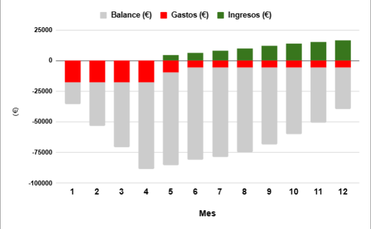
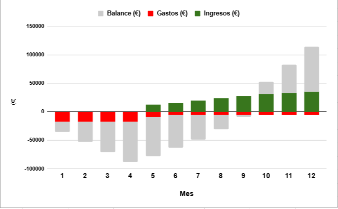
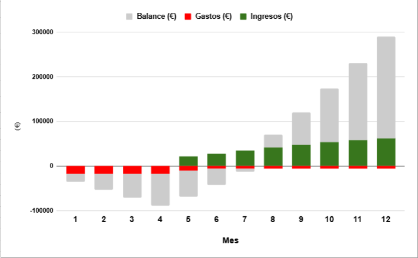

    

# Grupo 10 - Go4Surprise

## 10 - Short-MediumTermEconomicManagement

### Sprint 3

**Made by:** Mario Astudillo

### Integrantes

- Mohamed Abouri  
- Mario Astudillo Fierro  
- María Barrancos Márquez  
- Rafael Cabello Ranea  
- Manuel Chica López  
- David Delgado Pallares  
- José Gonzalo Domínguez Moreno  
- Virginia Mesa Pérez  
- José Manuel Miret Martín  
- Alejandro Nicolade Bravo  
- Manuel Palacios Pineda  
- Pablo Rodríguez Sánchez  
- Rubén Romero Sánchez  
- Paula Sánchez Gómez  
- Ramón Vergara Garrido  

---

### **1. Introducción**

Este documento presenta una proyección financiera de Go4Surprise a corto y medio plazo. Se analizan los costes mensuales estimados y se proyectan los ingresos en diferentes escenarios para evaluar la rentabilidad del proyecto.

### **2. Estimación de Costes Mensuales**

#### **2.1 Costes Iniciales Únicos:**

- **Dominio IONOS (primer año):** 1 €
- **Legal y registro de empresa:** 1.000 €

#### **2.2 Costes Mensuales:**

##### **2.2.1 Costes de Desarrollo y Mantenimiento:**

- **Infraestructura tecnológica:** 94 € (Google App Engine)

##### **2.2.2 Costes del Equipo por Mes (16 personas, 1 mes)**

**Salarios Brutos**

- **Frontend:** 8 personas × 20 €/h × 10 h/semana × 4 semanas **= 6.400 €**
- **Backend:** 8 personas × 22 €/h × 10 h/semana × 4 semanas **= 7.040 €**
- **Total en salarios brutos:** 6.400 € + 7.040 € **= 13.440 €**

**Costes Sociales (31.40%)**

31.40% de 13.440 € **= 4.219,20 €**

##### **2.2.3 Coste Total del Equipo por mes**

**Salarios + Costes Sociales = 13.440 € + 4.219 € = 17.659 €**

#### **Resumen de Costes por Mes:**

| **Concepto**                           | **Coste (€)** |
|----------------------------------------|---------------|
| **Desarrollo y mantenimiento**          | **94 €**       |
| **Coste del equipo (salarios + SS)**     | **17.659 €**   |
| **Total Gastos (por mes)**               | **18.253 €**   |

### **EN RESUMEN:**

- **Mes 1:** el Coste del equipo (salarios + SS) = 17.659 + 1001 de los costes iniciales únicos = 17.759€
- **Meses 1-3:** el Coste del equipo (salarios + SS) = 17.659 €
- **Mes 5:** gastos de -3,000 (marketing) - 4.157 (desarrollo) - 600 (procesamiento) - 960 (soporte) = -9.717€
- **Mes 6 en adelante:** gastos mensuales fijos -4.157 (mantenimiento) - 600 (procesamiento) - 960 (soporte) = -5.717€

## **3. Tabla de proyección de ingresos:**

La proyección de ingresos se basa en la función sigmoide, utilizada para modelar el crecimiento empresarial y la adopción de tecnologías en el mercado.

### **3.1 Escenarios de Crecimiento con la Curva Sigmoide**

La **curva sigmoide** se caracteriza por tres fases:

1. **Crecimiento lento al inicio** (adopción temprana, boca a boca).
2. **Crecimiento acelerado en el centro** (fase de expansión).
3. **Saturación y estabilización final** (mercado maduro).

Se define por la siguiente fórmula:

Donde:

- **L** = Ingreso máximo esperado a 12 meses
- **k** = Factor de crecimiento (determina qué tan rápido crecen los ingresos)
- **x₀** = Mes en el que ocurre el crecimiento más rápido (punto de inflexión)
- **e** = Número de Euler (≈ 2.718)

Cada escenario tiene diferentes valores para estos parámetros dejando notros fijos el factor de crecimiento en los 3 escenarios:

### **1. Escenario Pesimista:**

- L = 20,000 €
- k = 0,4
- x₀ = 8

### **2. Escenario Medio:**

- L = 40,000 €
- k = 0,4
- x₀ = 7

### **3. Escenario Optimista:**

- L = 70.000 €
- k = 0,4
- x₀ = 7

