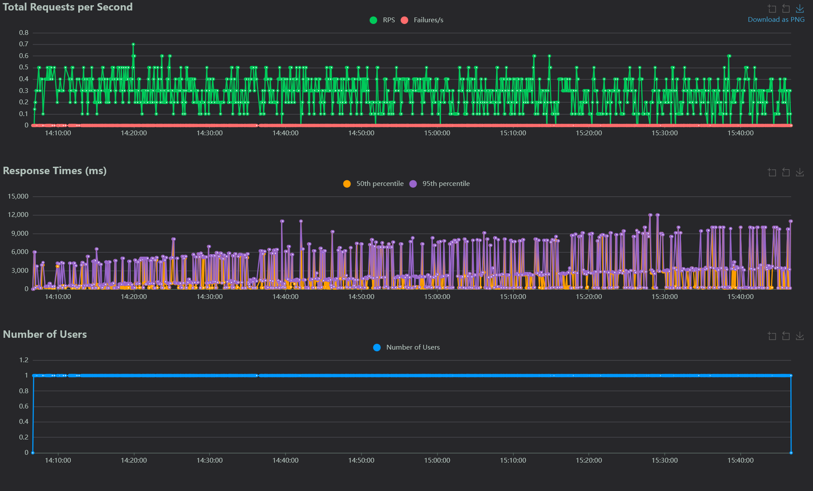

# Plan de pruebas

    

# Grupo 10 - Go4Surprise

## 10 - TestingPlan

### Sprint 3

**Made by:** Virginia Mesa

### Integrantes

- Mohamed Abouri  
- Mario Astudillo Fierro  
- María Barrancos Márquez  
- Rafael Cabello Ranea  
- Manuel Chica López  
- David Delgado Pallares  
- José Gonzalo Domínguez Moreno  
- Virginia Mesa Pérez  
- José Manuel Miret Martín  
- Alejandro Nicolade Bravo  
- Manuel Palacios Pineda  
- Pablo Rodríguez Sánchez  
- Rubén Romero Sánchez  
- Paula Sánchez Gómez  
- Ramón Vergara Garrido  

---

# 1. Alcance

- Se probarán las funcionalidades descritas en los apuntes, incluyendo pruebas unitarias, de integración, de extremo a extremo, de aceptación y de rendimiento.
- No se probarán aspectos fuera del alcance de la asignatura, como pruebas de seguridad avanzadas o pruebas de carga extremadamente pesadas.

# 2. Estrategia de Pruebas

Para garantizar la calidad y robustez del software, seguiremos esta estrategia:

- **Pruebas de camino feliz y Pruebas negativas:**
    - Realizaremos pruebas de camino feliz para validar el flujo principal de la aplicación.
    - También ejecutaremos pruebas negativas para verificar cómo el sistema maneja situaciones inesperadas o errores.
- **Pruebas Manuales y Automáticas:**
    - Utilizaremos una combinación de pruebas manuales y automáticas:
        - **Pruebas Manuales:**
            - Realizaremos exploración manual para descubrir posibles problemas no cubiertos por casos de prueba específicos.
            - Validaremos la interfaz de usuario, flujos de trabajo y escenarios de uso.
        - **Pruebas Automáticas:**
            - Implementaremos pruebas automatizadas para casos repetitivos y regresiones.
            - Utilizaremos herramientas como Selenium, JUnit o PyTest para automatizar pruebas de UI y lógica de negocio.
- **Casos de Prueba Específicos:**
    - Definiremos casos de prueba específicos para cada tipo de test:
        - **Pruebas Unitarias:**
            - Verificamos funciones individuales y componentes a nivel de código.
            - Validamos entradas válidas e inválidas.
        - **Pruebas de Integración:**
            - Probamos la comunicación entre módulos y servicios.
            - Verificamos la integración con base de datos y APIs externas.
        - **Pruebas de Aceptación:**
            - Validamos que el sistema cumpla con los requisitos del cliente.
            - Probaremos la usabilidad y la experiencia del usuario.
        - **Pruebas de Rendimiento:**
            - Establecemos umbrales de rendimiento aceptables (tiempos de respuesta, capacidad de carga).
            - Ejecutamos pruebas de carga y estrés para evaluar el rendimiento bajo diferentes condiciones.

# 3. Recursos necesarios

Los recursos necesarios para llevar a cabo nuestro plan de pruebas es el siguiente:

- Equipo de desarrollo: Miembros del equipo de desarrollo de Go4Surprise responsables de implementar las pruebas.
- Herramientas de prueba: JMeter, Selenium, JUnit 5, Gatling, Katalon Recorder, Pytest , entre otras.
- Ambientes de pruebas: entornos de desarrollo, preproducción y producción para pruebas de rendimiento.

# 4. Casos de Prueba:

Los casos de prueba son escenarios específicos diseñados para verificar el correcto funcionamiento de un software. Aquí están los diferentes tipos de pruebas y los escenarios que se presentan en nuestra aplicación:

- **Pruebas Unitarias**
    - **Objetivo**: Probar cada entidad teniendo en cuenta todas sus funciones en la `view.py`cubriendo la cobertura de más del 70% después del análisis de cobertura.
    - **Escenarios**:
        - Hacer prueba de views de la entidad `bookings`
        - Hacer prueba de views de la entidad `users`
        - Hacer prueba de views de la entidad `experiences`
        - Hacer prueba de views de la entidad `reviews`
- **Pruebas de Integración**
    - **Escenarios:**
        - **Objetivo**: Asegurar que la conexión con elementos externos funcione correctamente y que la información intercambiada se procese adecuadamente. No estamos probando de nuevo la lógica de la aplicación, sino la interacción con otros sistemas. En este caso, usaremos Go4Surprise.
        - **Pruebas de integración de base de datos:**
            1. Iniciar una base de datos.
            2. Conectar la aplicación Go4Surprise a la base de datos.
            3. Activar una función dentro del código de Go4Surprise que escriba datos en la base de datos.
            4. Verificar que los datos esperados se hayan escrito en la base de datos leyendo los datos de la base de datos.
            
        - **Pruebas de integración de servicio externo:**
            1. Iniciar aplicación Go4Surprise.
            2. Iniciar una instancia de cada servicio externo.
            3. Activar una función dentro del código de Go4Surprise que lea de la API de cada servicio externo.
            4. Verificar que la aplicación Go4Surprise puede analizar correctamente la respuesta de cada servicio externo.
        
- **Pruebas de Aceptación**
    - **Objetivo**: Verificar que el sistema cumpla con los requisitos del cliente descritos en los escenarios de aceptación. Probar la usabilidad y la experiencia del usuario en situaciones normales y de excepción.
    - **Escenarios:**
        - Ver el perfil de usuario y editarlo.
        - Registro de usuario
        - Inicio de sesión
        - Listado, cancelación y creación de una reserva
        - Añadir reserva al calendario
        - Pago de la reserva
        - Añadir reseñas
        
- **Pruebas de Rendimiento**
    - **Objetivo**: Realizar pruebas de carga para determinar el comportamiento del sistema bajo diferentes niveles de carga. Ejecutar pruebas de estrés para identificar el punto de quiebre del sistema y su capacidad de recuperación. Para estas pruebas hemos usado la herramienta **Locust**.
    - **Escenarios:**
        
        Durante la prueba de rendimiento se simularon diferentes flujos de uso representativos de usuarios finales y administradores. Se incluyeron tanto operaciones de lectura como de escritura, distribuidas de forma proporcional para simular un entorno realista. A continuación, se detallan:
        
        - Evaluar la eficiencia del sistema en la creación, visualización y gestión de reservas tanto por usuarios como por administradores.
        - Medir la rapidez en el inicio de sesión, recuperación de información del perfil y actualización de preferencias del usuario.
        - Comprobar la agilidad del sistema al listar y modificar experiencias publicadas en la plataforma.
        - Validar el rendimiento en la creación y consulta de reseñas por parte de los usuarios, asegurando una carga fluida de comentarios.
        - Verificar que las operaciones administrativas (como la gestión de usuarios y reservas) no afecten la estabilidad ni los tiempos de respuesta generales del sistema.
    - **Umbrales de rendimiento**: Este tiene que cumplir con unos umbrales:
        - **Capacidad de manejo de carga:**
            - El sistema debe ser capaz de sostener al menos **1 request/segundo sin fallos**, con tiempos de respuesta consistentes.
            - Durante las pruebas se logró mantener entre **0.2 y 0.5 req/s sin errores**, lo cual cumple para carga base, pero debe escalarse a más usuarios para validar elasticidad.
        - **Tiempo de carga de la página inicial:**
            - Objetivo: Menor a **1 segundo** en condiciones normales.
            - Resultado: No medido explícitamente en la prueba, pero el backend mostró buena latencia general en rutas livianas.
        - **Tiempo de Inicio de Sesión y Autenticación:**
            - Objetivo: Menor a **800 ms**.
            - Resultado: No medido directamente en el log, pero se sugiere incluirlo en la siguiente ronda de pruebas.
        - **Tiempo de Creación de Reservas:**
            - Objetivo: Menor a **1 segundo**.
            - Resultado: **POST `/bookings/crear-reserva/` tuvo un promedio de 238 ms** y un máximo de 808 ms, por lo tanto, **cumple ampliamente**.

# 5. Criterios de Aceptación

Las pruebas se considerarán exitosas si todas las funcionalidades probadas cumplen con los criterios de aceptación definidos. Estos criterios ayudarán a garantizar que la aplicación cumpla con los estándares de calidad y satisfaga las necesidades de los usuarios:

- **Registro de Usuario:**
    - **Given** un usuario no registrado
    - **When** el usuario completa el formulario de registro con información válida
    - **Then** el usuario debería ser redirigido al inicio de sesión para verificar el correo y acceder a. la aplicación.
    
- **Inicio de sesión:**
    - **Given** un usuario autenticado
    - **When** el usuario inicia sesión con credenciales válidas
    - **Then** el usuario debería acceder a la página principal de la aplicación.
    
- **Perfil de Usuario:**
    - **Given** un usuario autenticado
    - **When** el usuario accede a la página de perfil
    - **Then** el usuario debería poder ver y editar su información.
    
- **Listado de Reserva:**
    - **Given** un usuario autenticado
    - **When** el usuario accede al listado de reservas
    - **Then** el usuario debería poder ver sus reservas pendientes

- **Cancelación de Reserva:**
    - **Given** un usuario autenticado
    - **When** el usuario cancela la reserva en las primeras 24 horas después de su compra.
    - **Then** el usuario debería recibir un correo de confirmación de la cancelación y la información sobre su reembolso.
    
- **Añadir al calendario:**
    - **Given** un usuario autenticado
    - **When** el usuario en el listado de reservas pulsa para añadir al calendario.
    - **Then** el usuario debería ser redirigido al calendario de google para añadirlo.
    
- **Creación de reserva:**
    - **Given** un usuario autenticado
    - **When** el usuario crea una reserva
    - **Then** el usuario es redirigido al pago de la reserva
    
- **Pago de la Reserva:**
    - **Given** un usuario autenticado
    - **When** el usuario realiza correctamente el pago de la reserva
    - **Then** el usuario debería ver su reserva en su listado de reservas y debería poder ver una cuenta atrás en la página principal.
    
- **Dejar reseña:**
    - **Given** un usuario autenticado
    - **When** el usuario accede a su listado de reservas pasadas
    - **Then** el usuario debería poder dejar una reseña de sus experiencias vividas.

# 6. Resultados

- **Pruebas unitarias:**
    - Vemos que las pruebas unitarias de las entidades pasas satisfactoriamente, teniendo pruebas de todos los módulos de la aplicación. Con una cobertura del 75%.

    .png)
    .png)
    .png)

    - **Pruebas de Integración:**
    
    Las pruebas de integración se han ejecutado junto a las pruebas unitarias. Esta decisión ha venido tomada por que las llamadas a servicios externos están integrados dentro de nuestros servicios del backend. También se han llevado en estas pruebas flujos completos, que hacen uso de varios servicios al mismo tiempo. Como se ha podido ver la cobertura ha llegado al 75%.

    - **Pruebas de aceptación:**
    - Un ejemplo de prueba de aceptación podría ser el tests del inicio de sesión. En este caso arrancamos backend y frontend con los comandos (python manage.py runserver ,  npm start). Al ejecutar la prueba se abre la pantalla de login de nuestra app e introduce las credenciales correctar y le redirige a la pagina principal de la aplicación:

        .png)
        .png)
        .png)

    - **Pruebas de rendimiento:**

Durante el test de rendimiento realizado con **Locust**, se ejecutaron múltiples peticiones a lo largo de más de una hora, simulando tráfico constante sobre el sistema. A continuación, se presentan los resultados clave extraídos del gráfico:

**Total de Requests por Segundo (RPS)**

- Se mantuvo de forma bastante **estable entre 0.2 y 0.5 req/s**.
- El sistema respondió consistentemente sin caídas bruscas ni fallos, como lo indica la **ausencia total de errores (línea roja en 0)**.

Esto sugiere que el backend es **estable bajo la carga actual**, con buena capacidad de respuesta para peticiones concurrentes.

**Tiempos de Respuesta**

- El **percentil 50 (mediana)** (naranja) se mantuvo en torno a los **600–1600 ms** en la mayoría de los casos.
- El **percentil 95 (lila)** muestra algunos **picos considerables**, alcanzando incluso los **más de 10,000 ms** en momentos puntuales.

Esto indica que aunque la mayoría de las respuestas fueron aceptables, existen **outliers** que reflejan **cuellos de botella o procesos costosos** en ciertas rutas del sistema.

# 7. Conclusiones de los Resultados

- Se documentarán los resultados de las pruebas, incluyendo cualquier error encontrado y acciones correctivas tomadas.
- Se realizará un análisis de los resultados para identificar áreas de mejora y posibles problemas pendientes.