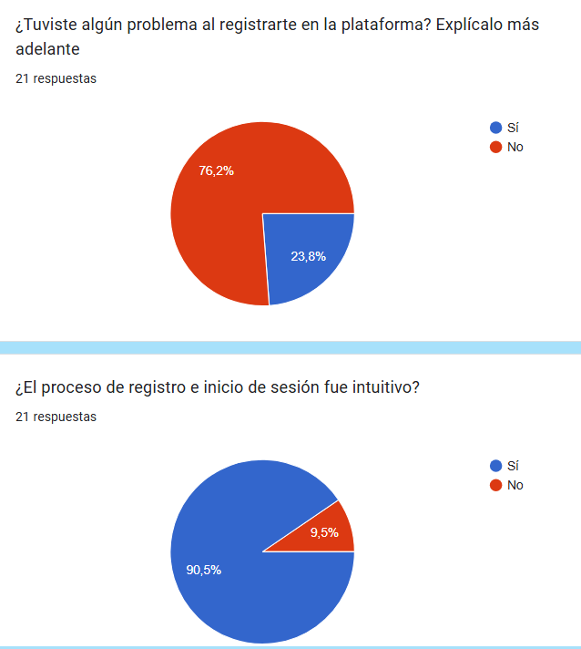

#

    

# Grupo 10 - Go4Surprise

## 10 - pilotUsers

### Sprint 3

**Made by:** David Delgado

### Integrantes

- Mohamed Abouri  
- Mario Astudillo Fierro  
- María Barrancos Márquez  
- Rafael Cabello Ranea  
- Manuel Chica López  
- David Delgado Pallares  
- José Gonzalo Domínguez Moreno  
- Virginia Mesa Pérez  
- José Manuel Miret Martín  
- Alejandro Nicolade Bravo  
- Manuel Palacios Pineda  
- Pablo Rodríguez Sánchez  
- Rubén Romero Sánchez  
- Paula Sánchez Gómez  
- Ramón Vergara Garrido  

---

# Introducción

Este documento detalla el proceso de gestión de los usuarios piloto para comprobar el funcionamiento de la aplicación Go4Surprise, asegurando su correcta integración, comunicación y análisis de feedback. Los usuarios pilotos nos permitirán validar nuestra idea de negocio, mejorar la experiencia y detectar posibles mejoras antes del lanzamiento final de la aplicación.

# Gestión de Usuarios Piloto

## **Selección de Usuarios y categorías**

Los usuarios piloto se han seleccionado mediante una encuesta previa en la que se recoge información detallada de cada usuario.

En la siguiente tabla se muestra una lista de los usuarios pilotos que se ofrecieron a colaborar en este proyecto dándonos su feedback, el cual nos ayudará para guiarnos en la creación de las distintas funcionalidades gracias a las necesidades de estos usuarios acerca de la idea de nuestra aplicación: Go4Surprise

En total contaremos con la colaboración de 46 usuarios piloto para este proyecto.

| **Nº** | **NOMBRE** | DP | S1 | S2 | S3 | FINAL |
| --- | --- | --- | --- | --- | --- | --- |
| 1 | Ignacio Blanquero Blanco | ✅ | ✅ | ✅ | ✅ |  |
| 2 | Isabel Cantero Corchero | ✅ | ✅ | ✅ | ✅ |  |
| 3 | Yao Jun | ✅ | ✅ | ✅ | ✅ |  |
| 4 | Guadalupe Ridruejo Pineda | ✅ | ✅ | ✅ | ✅ |  |
| 5 | Manuel Pérez Vélez | ✅ | ✅ | ✅ | ✅ |  |
| 6 | Alvaro Martín Muñoz | ✅ | ✅ | ✅ | ✅ |  |
| 7 | Pablo Fernández Pérez | ✅ | ✅ | ✅ | ✅ |  |
| 8 | Laura M.P. | ✅ | ✅ | ✅ |  |  |
| 9 | Manuel M.I. | ✅ | ✅ | ✅ | ✅ |  |
| 10 | Ana María M.B. | ✅ | ✅ | ✅ | ✅ |  |
| 11 | Lidia Maria R.D. | ✅ | ✅ |  | ✅ |  |
| 12 | Aida V.C. | ✅ | ✅ |  |  |  |
| 13 | Ángela R.M. | ✅ | ✅ |  | ✅ |  |
| 14 | Rubén C.T. | ✅ | ✅ | ✅ | ✅ |  |
| 15 | Curro G.F. | ✅ | ✅ |  |  |  |
| 16 | Laura O.M. | ✅ | ✅ | ✅ |  |  |
| 17 | Merche L.M. | ✅ | ✅ |  |  |  |
| 18 | David V.J. | ✅ | ✅ |  |  |  |
| 19 | María J.E. | ✅ | ✅ | ✅ |  |  |
| 20 | Victor L.G. | ✅ | ✅ |  |  |  |
| 21 | Laura J.F. | ✅ |  |  |  |  |
| 22 | Alba María M.C. | ✅ |  |  |  |  |
| 23 | Alejandro L.P. | ✅ |  |  |  |  |
| 24 | Marta L.A | ✅ |  | ✅ |  |  |
| 25 | Rafa P.B. | ✅ |  |  |  |  |
| 26 | Andrea E.G. | ✅ |  |  |  |  |
| 27 | Jesús M.C. | ✅ |  |  |  |  |
| 28 | María R. | ✅ |  |  |  |  |
| 29 | Daniel R.G. | ✅ |  |  |  |  |
| 30 | Rafa M.R. | ✅ |  |  |  |  |
| 31 | Jaime D. | ✅ |  |  |  |  |
| 32 | Carlos M.R. | ✅ |  |  |  |  |
| 33 | Carolina A.J. | ✅ |  |  |  |  |
| 34 | Marta J.A | ✅ |  | ✅ |  |  |
| 35 | Alejandro M.I. | ✅ |  |  |  |  |
| 36 | Francisco B. | ✅ |  |  |  |  |
| 37 | Francisco C.M. | ✅ |  |  | ✅ |  |
| 38 | Marta M.J. | ✅ |  |  |  |  |
| 39 | Pilar P.G. | ✅ |  | ✅ |  |  |
| 40 | Irene D.M. | ✅ |  |  |  |  |
| 41 | Patricia J.P. | ✅ |  |  |  |  |
| 42 | Natalia R.C. | ✅ |  |  |  |  |
| 43 | Nacho P.P. | ✅ |  |  |  |  |
| 44 | María C.Q. | ✅ |  |  |  |  |
| 45 | Antonio M.M. |  |  | ✅ |  |  |
| 46 | Juan Antonio G.L. |  |  | ✅ | ✅ |  |

## Planificación de pruebas y feedback

### Sprint 1

Durante este primer sprint en un inicio hemos planteado dividir cada una de las tareas principales (Inicio de sesión, Base de datos, Pantalla principal, Formulario) en diferentes tareas:

- INICIO DE SESIÓN:
    - Registro
    - Inicio de sesión
    - Cuestionario inicial
    - Perfil del usuario
- SISTEMA DE RESERVAS
    - Cuestionario del evento sorpresa
    - Listado de las reservas del usuario
    - Pantalla principal
    - Mostrar las reseñas y los eventos registrados

### Sprint 2

- PERFIL DE USUARIO
    - Recuperar contraseña
- RESERVA DEL EVENTO SORPRESA:
    - Mapa de selección geográfica
    - Descartar categorías (CASO DE USO)
    - Pistas del evento sorpresa por correo (CASO DE USO)
- PASARELA DE PAGO
    - Configuración de la pasarela de pago
    - Conectar con la pasarela de pago
    - Cálculo del precio de la reserva total y por persona
    - Webhook

### Sprint 3

| **Tarea** | **Duración** | **Descripción** |
| --- | --- | --- |
| **Implementación de calendario y notificaciones** | 4 días | Desarrollar sistema de notificaciones y recordatorios para usuarios. |
| **Optimización y corrección de errores** | 3 días | Resolver bugs y mejorar rendimiento. |
| **Desarrollo de la red social interna** | 4 días | Implementar sistema básico de interacciones y compartición de experiencias. |

## Comunicación

Los principales canales de comunicación con los usuarios pilotos serán:

- **Email:** Confirmaciones, recordatorios y encuestas.
- **Grupo de WhatsApp:** Comunicación directa y resolución de dudas.
- **Reuniones virtuales:** Entrevistas/Reuniones mediante un servidor de Discord al que todos tendrán acceso para recibir un feedback más detallado, donde poder informar de errores o incidencias.
- **Google Forms:** Encuestas para recopilar el feedback y tener evidencias concretas de la satisfacción de los usuarios.

## Recompensas

Para incentivar la participación activa, los usuarios piloto recibirán:

- Descuentos exclusivos en futuras experiencias.
- Acceso a eventos VIP.
- Sorteos de experiencias sorpresa.
- Beneficios adicionales por completar encuestas detalladas.

## Análisis de feedback

Los datos recopilados se analizarán mediante:

- Encuestas de satisfacción.
- Evaluación de funcionalidades y experiencia de usuario.
- Identificación de mejoras y puntos de fricción.

Los datos recopilados y las aportaciones realizadas por los usuarios pilotos se recogerán en un documento que contendrá:

- Fecha de acceso al sistema
- Fecha del feedback
- Fallos y mejoras aportadas
- Métricas de satisfacción del usuario
- Puntuaciones de usabilidad
- Tiempos de espera

Este documento servirá para mantener una trazabilidad del feedback, y poder ver cómo evoluciona éste durante el desarrollo de la aplicación, optimizando la plataforma antes del lanzamiento oficial.

## Compromisos

Los compromisos que tienen los usuarios piloto con Go4Surprise vienen recogidos en el documento “pilotUsersCommitmentAgreement”.

- Los usuarios piloto se comprometen a probar la aplicación dentro del periodo establecido y a proporcionar feedback detallado y constructivo sobre su experiencia.
- Se comprometen a entregar ese feedback como máximo a las 12:00h del día de finalización del sprint.
- Se comprometen a seguir las instrucciones proporcionadas en la “Guía para Usuarios Piloto” en cada sprint.
- Los usuarios piloto aceptan no divulgar información sensible o detalles sobre la
plataforma a terceros.
- Las pruebas se realizan a lo largo del desarrollo de la aplicación, con un calendario estructurado para garantizar una evaluación progresiva.

# Planificación de Usuarios Piloto

| **ETAPA** | **DESCRIPCIÓN** | **FECHA INICIO** | **FECHA FINAL** |
| --- | --- | --- | --- |
| **DP** | Encuesta inicial para la búsqueda | 17/02/2025 | 20/02/2025 |
| **S1** | Lanzamiento de la primera versión de Go4Surprise | 10/03/2025 | 13/03/2025 |
| **S2** | Despliegue de Go4Surprise con las funcionalidades añadidas durante el Sprint 1 junto con las correcciones sobre errores técnicos y de diseño detectados | 24/03/2025 | 27/03/2025 |
| **S3** | Despliegue de Go4Surprise con las funcionalidades añadidas durante el Sprint 2 junto con las correcciones sobre errores técnicos y de diseño detectados | 07/04/2025 | 10/04/2025 |
| **PPL** | Comprobación del correcto funcionamiento de las funcionalidades añadidas durante los sprints 1,2,3 junto con las revisiones realizadas a partir del feedback | 28/04/2025 | 01/05/2025 |
| **WPL** | Probar la versión final pre-lanzamiento Go4Surprise | 19/05/2025 | 22/05/2025 |

# Feedback Recibido en el Sprint 1

### En total, hemos recibido feedback de 22 de nuestros usuarios piloto:

## Respuestas a la encuesta:

### Registro e inicio de sesión:

### Interfaz y usabilidad

### Reserva de experiencias

### Mis Reservas y Perfil de Usuario

### Compatibilidad y accesibilidad

### Experiencia general y feedback

### Feedback General

# Análisis del Feedback Recibido en el Sprint 1

Tras analizar las distintas respuestas de los usuarios pilotos después de probar la aplicación en su versión inicial, hemos identificado las tareas más importantes a solucionar y/o implementar de cara a mejorar la aplicación para el Sprint 2:

- [ ]  Hacer que el perfil de usuario se pueda modificar la foto
- [x]  Hacer la encuesta más general en cuanto a preferencias
- [ ]  Añadir barras de progreso en el cuestionario
- [x]  Añadir en la encuesta preguntas para gente con restricciones alimentarias o de salud como intolerancias y alergias
- [x]  Elección de una franja horaria, mañana, tarde o noche
- [x]  Añadir una landing-page con información acerca de Go4Surprise en la pantalla principal
- [x]  Permitir eventos que te puedas llevar mascota (48 horas antes, como pista
- [ ]  Hacer la aplicación más atractiva visualmente
- [x]  Añadir más variedad de preguntas en el cuestionario inicial de preferencias
- [x]  Tramo por edades en la selección de eventos, por ejemplo para personas menores de edad o gente senior (No sé a que se refiere)
- [ ]  Mejorar el diseño de la aplicación en formato móvil
- [x]  Indicar en el cuestionario si se puede seleccionar mas de una opción
- [x]  No permitir la selección de ninguna otra opción cuando se seleccione la opción “Nada en concreto” .
- [x]  Mejorar la sección del registro añadiendo más espacio entre los campos
- [ ]  Incluir registrarse con cuentas secundarias
- [ ]  Arreglar el enlace de enviar un correo para recuperar contraseña
- [x]  Añadir botón para volver atrás en algunas secciones
- [ ]  Colocar el botón para ir a la página de inicio en el perfil de usuario en la parte superior
- [ ]  Mantener el mismo idioma en todas la aplicación
- [x]  Indicar la moneda elegida para el precio
- [x]  Aclarar si el precio de la reserva es el total o es por persona
- [ ]  Arreglar que la fecha de la reserva sea posterior a la contratación y comprobar que sea válida según nuestras restricciones
- [x]  Arreglar que el número de participantes no pueda ser menor o igual que 0
- [x]  Arreglar que el precio no pueda ser menor o igual que 0
- [ ]  Añadir una sección para las opiniones de las personas, no está funcionando el botón
- [x]  Incluir opiniones más recientes de las experiencias
- [ ]  Añadir comentarios en el frontend para indicar las restricciones que existan en el backend de correo electrónico o de número de teléfono
- [ ]  Indicar que el teléfono no sea obligatorio.
- [x]  Añadir un campo en el registro para confirmar que la contraseña introducida es correcta.
- [ ]  Añadir un botón para que se pueda visualizar la contraseña en el registro y en el inicio de sesión.
- [x]  Indicar en el historial de reservas si son las reservas ya realizadas o reservas que están aún por hacer.
- [x]  que se puedan ver los registros que has hecho
- [x]  Comprobar el correcto funcionamiento de la eliminación de la cuenta
- [x]  Actualizar los colores de la encuesta de preferencias
- [x]  Añadir un botón para cancelar la reserva en la sección de “MIS RESERVAS”
- [x]  Actualizar cuestionario de preferencias
- [ ]  No permitir que el nombre y el apellido contengan números
- [x]  Añadir una barra de rango de precios para realizar la reserv
- [ ]  Arreglar las horas de la reserva
- [x]  Añadir la opción de eliminar las reservas
- [x]  Añadir una cuenta atrás de la reserva más reciente
- [x]  Solucionar error en el registro
- [x]  Añadir validaciones para cada uno de los campos en el registro

# Resumen del Feedback Recibido en el Sprint 1:

## Feedback Positivo:

- Idea innovadora y atractiva para los usuarios
- Proceso de registro sencillo y directo
- Interfaz intuitiva y fácil de navegar
- Buena organización de las secciones principales

## Feedback Negativo

- Falta de algunas funcionalidades esenciales
    - Cancelación de reservas
    - Edición del perfil de usuario
- Inconsistencias en el diseño y la experiencia de usuario
- Limitaciones en el sistema de preferencias
- Problemas técnicos en la gestión de fechas
- Validaciones en el registro de usuario

## Recomendaciones de mejora:

- Mejorar la experiencia móvil y la adaptabilidad
- Ampliar las opciones de personalización en el cuestionario de preferencias
    - Añadir restricciones alimentarias o de salud
- Selección de franja temporal en las reservas
- Posibilidad de mezclar grupos de personas con preferencias parecidas
- Implementar un sistema de validación de datos tanto en el backend como en el frontend
- Mejorar la gestión de las reservas y cancelaciones
- Unificar el diseño de la interfaz visual y consistencia en el idioma de la aplicación
- Añadir información acerca de Go4Surprise en la página de inicio
- Mejorar la accesibilidad y las opciones de inclusividad

# Feedback Recibido en el Sprint 2

### En total, hemos recibido feedback de 23 de nuestros usuarios piloto:

## Respuestas a la encuesta:

### Registro e inicio de sesión:

### Interfaz y usabilidad

### Reserva de experiencias

### Mis Reservas

### Mi Perfil

### Compatibilidad y accesibilidad

### Feedback General

### Otras consideraciones

# Análisis del Feedback Recibido en el Sprint 2

Tras analizar las distintas respuestas de los usuarios pilotos después de probar la aplicación en su versión inicial, hemos identificado las tareas más importantes a solucionar y/o implementar de cara a mejorar la aplicación para el Sprint 3:

- [ ]  Mejorar la validación de los campos de registro para asegurar datos correctos
- [x]  Implementar la funcionalidad de cancelación de reservas
- [ ]  Optimizar la experiencia de usuario en dispositivos móviles
- [ ]  Añadir más información sobre las experiencias y sus restricciones
- [ ]  Mejorar el sistema de notificaciones y recordatorios de reservas
- [ ]  Implementar un sistema de filtrado más completo para las experiencias
- [ ]  Añadir más opciones de personalización en el perfil de usuario
- [ ]  Mejorar la visualización del historial de reservas
- [ ]  Implementar un sistema de valoraciones y reseñas más robusto
- [ ]  Optimizar los tiempos de carga y respuesta de la aplicación
- [ ]  Añadir más métodos de pago y mejorar el proceso de reserva
    - [ ]  Mejorar la accesibilidad general de la aplicación
- [ ]  Implementar un sistema de búsqueda avanzada de experiencias
- [ ]  Añadir más idiomas y mejorar la consistencia en las traducciones
- [ ]  Implementar un sistema de recomendaciones personalizado

# Resumen del Feedback Recibido en el Sprint 2:

## Feedback Positivo:

- Mejoras significativas en la interfaz y experiencia de usuario desde el Sprint 1
- Mayor facilidad en el proceso de registro y gestión de reservas
- Buena acogida del sistema de preferencias implementado
- Valoración positiva de la velocidad de respuesta de la aplicación

## Feedback Negativo

- Necesidad de mejorar la validación de datos en los formularios
- Falta de opciones para cancelar o modificar reservas existentes
- Problemas de compatibilidad en algunos dispositivos móviles
- Inconsistencias en el idioma a través de la aplicación

## Recomendaciones de mejora:

- Implementar un sistema más robusto de validación de datos en todos los formularios
- Mejorar la experiencia móvil con un diseño más responsive y adaptativo
- Añadir más opciones de personalización y filtrado en la búsqueda de experiencias

# Feedback Recibido en el Sprint 3

### En total, hemos recibido feedback de 14 de nuestros usuarios piloto:

## Respuestas a la encuesta:

### Registro e inicio de sesión:

### Interfaz y usabilidad

### Reserva de experiencias

### Mi Perfil

### Compatibilidad y accesibilidad

### Feedback General

### Otras consideraciones

# Análisis del Feedback Recibido en el Sprint 3

Tras analizar las distintas respuestas de los usuarios pilotos después de probar la aplicación en su versión inicial, hemos identificado las tareas más importantes a solucionar y/o implementar de cara a mejorar la aplicación para la siguiente entrega (PPL):

- [ ]  Mejorar y expandir el sistema de notificaciones para reservas y actualizaciones
- [ ]  Implementar más opciones de filtrado avanzado en la búsqueda de experiencias
- [ ]  Integrar métodos de pago adicionales y optimizar el proceso de transacción
- [ ]  Refinar la interfaz de usuario para mayor consistencia visual
- [ ]  Ampliar la documentación y ayuda disponible para usuarios
- [ ]  Optimizar el rendimiento general de la aplicación
- [ ]  Mejorar la accesibilidad para usuarios con necesidades especiales
- [ ]  Implementar sistema de reseñas y valoraciones más detallado

# Resumen del Feedback Recibido en el Sprint 3:

## Feedback Positivo:

- Mejora significativa en la validación de datos y proceso de registro
- Mayor fluidez y facilidad de uso en la navegación general
- Implementación exitosa del sistema de cancelaciones de reservas
- Optimización notable del rendimiento en dispositivos móviles

## Feedback Negativo

- Necesidad de un sistema de notificaciones más completo y personalizable
- Limitaciones en las opciones de filtrado avanzado para búsqueda de experiencias
- Proceso de pago podría ser más intuitivo y ofrecer más opciones

## Recomendaciones de mejora:

- Desarrollar un sistema de notificaciones más robusto y personalizable
- Expandir las opciones de filtrado y búsqueda avanzada
- Optimizar y simplificar el proceso de pago con más opciones
- Mejorar la documentación y ayuda al usuario
- Implementar más funcionalidades de accesibilidad
