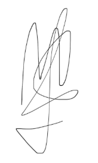
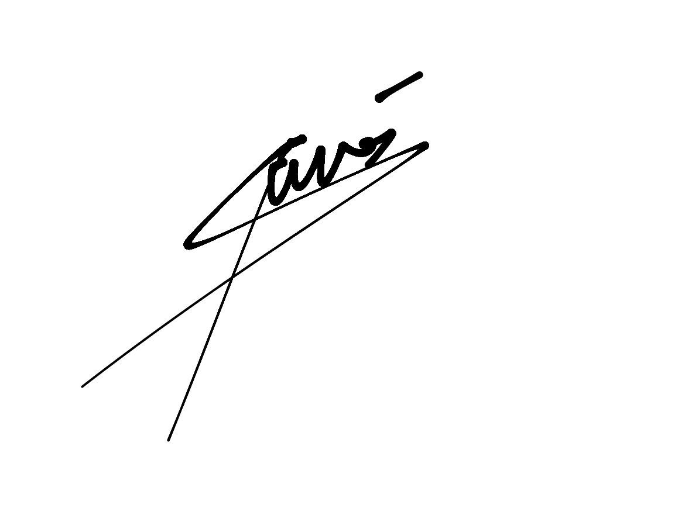
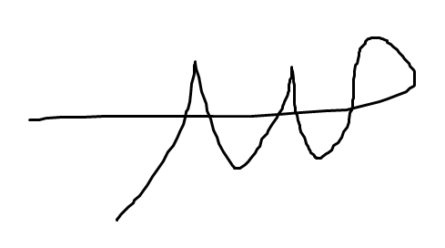
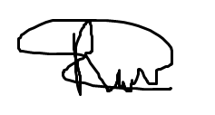
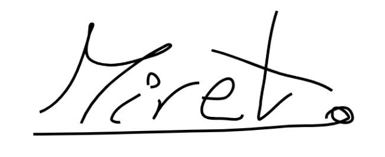
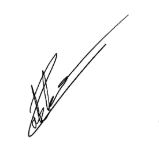

    

# Grupo 10 - Go4Surprise

## 10 - Commitment Agreement

### World Project Launch

**Made by:** José Manuel Miret

### Integrantes

- Mohamed Abouri  
- Mario Astudillo Fierro  
- María Barrancos Márquez  
- Rafael Cabello Ranea  
- David Delgado Pallares  
- José Gonzalo Domínguez Moreno  
- Virginia Mesa Pérez  
- José Manuel Miret Martín  
- Alejandro Nicolade Bravo  
- Manuel Palacios Pineda  
- Pablo Rodríguez Sánchez  
- Rubén Romero Sánchez  
- Paula Sánchez Gómez  
- Ramón Vergara Garrido  

---

## **Compromiso de Participación en la Asignatura ISPP**  
*(Ingeniería del Software y Práctica Profesional) - Curso 2024-25*

### **Datos de los Alumnos:**

**Nombre:** Virginia Mesa Pérez, Mario Astudillo Fierro, Alejandro Nicolalde Bravo, David Delgado Pallares, Pablo Rodríguez Sánchez, José Manuel Miret Martín, Paula Sánchez Gómez, María Barrancos Márquez, Ramón Vergara Garrido, Manuel Palacios Pineda, Rubén Romero Sánchez, Mohamed Abouri, Rafael Cabello Ranea, José Gonzalo Domínguez Moren.  
**Fecha:** 10/04/2025  
**Grupo de Trabajo:** G10

### **Compromiso:**

Yo, (todos), al incorporarme a la asignatura de Ingeniería de Software y Práctica Profesional (ISPP) para el curso 2024-25, me comprometo a cumplir con los siguientes requisitos y condiciones como miembro activo del grupo de trabajo, compuesto por aproximadamente 15 personas:

- **Dedicación de Tiempo:** Me comprometo a dedicar un esfuerzo de 10 horas semanales a las actividades y tareas asignadas en el marco de la asignatura, incluyendo la asistencia a clase.
- **Esfuerzo:** Me comprometo a retirarme voluntariamente del grupo para no obstaculizar el progreso de este si mi esfuerzo no alcanza al menos el 50% de lo requerido.
- **Finalización de Tareas:** Me comprometo a finalizar mis tareas asignadas a tiempo, especialmente en aquellos casos en los que el incumplimiento de mis responsabilidades pueda resultar en la necesidad de que mis compañeros trabajen en días festivos.
- **Registro de Tiempo:** Me comprometo a registrar el tiempo dedicado a cada tarea utilizando la herramienta TimeCamp, proporcionando el detalle necesario para cada tarea según se requiera.

## **Cuestiones establecidas por el equipo**

### **Compromisos**

Todos los miembros del equipo 10 al incorporarnos a la asignatura de Ingeniería de Software y Práctica Profesional (ISPP) para el curso 2024-25 nos comprometemos a:

- **Participación activa:** Colaborar de forma proactiva dentro del equipo. En caso de que algún miembro necesite apoyo, ofrecer ayuda siempre que se hayan finalizado las propias tareas.
- **Comunicación efectiva:** Mantener una comunicación fluida con el equipo, ya sea en persona, mediante videollamadas o por mensajes.
- **Avance en las tareas:** Iniciar las tareas asignadas con antelación y avanzar al menos hasta la mitad del trabajo antes del plazo estipulado, es decir, como mínimo un día antes de la entrega.
- **Asistencia a reuniones:** Participar en al menos una de las dos reuniones semanales, asistiendo puntualmente según el horario acordado por el grupo.
- **Registro de tiempo:** Registrar el tiempo dedicado a la asignatura en la aplicación TimeCamp para facilitar la elaboración del informe tiempo-esfuerzo individual y grupal.

En el caso de que alguno de estos puntos no lo cumpla un integrante del grupo, el resto del grupo avisará a este compañero. Sin embargo, cuando a este compañero se le avise tres veces, el coordinador penalizará de forma negativa en la nota final de este miembro.

Al firmar este documento, entiendo y acepto las responsabilidades que se me han asignado y me comprometo a cumplirlas según lo establecido en este documento.

### **Firma del Alumno:**

|  |  |  |  |
|--------------------------------------|--------------------------------------|--------------------------------------|--------------------------------------|
|  |  |  |  |
|  |  |  |  |
|  |  |  |                                    |
