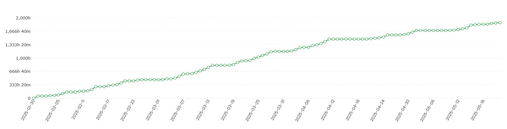

    

# Grupo 10 - Go4Surprise

## 10 - Time Effort Report

### Preparing Project Launch

**Made by:** Paula Sánchez

### Integrantes

- Mohamed Abouri  
- Mario Astudillo Fierro  
- María Barrancos Márquez  
- Rafael Cabello Ranea  
- David Delgado Pallares  
- José Gonzalo Domínguez Moreno  
- Virginia Mesa Pérez  
- José Manuel Miret Martín  
- Alejandro Nicolade Bravo  
- Manuel Palacios Pineda  
- Pablo Rodríguez Sánchez  
- Rubén Romero Sánchez  
- Paula Sánchez Gómez  
- Ramón Vergara Garrido  

---

## Time Effort Report

En este documento se presenta las horas hechadas por cada uno de los miembros del equipo durante todo el proyecto, esto se acompaña de una gráfica que muestra el avance del proyecto. Para poder acceder al aplicación ha de iniciar sesión [aquí](https://app.timecamp.com) con usuario **go4surprise.ispp@gmail.com** y contraseña **P4bl0-4pru3b4n0s**

